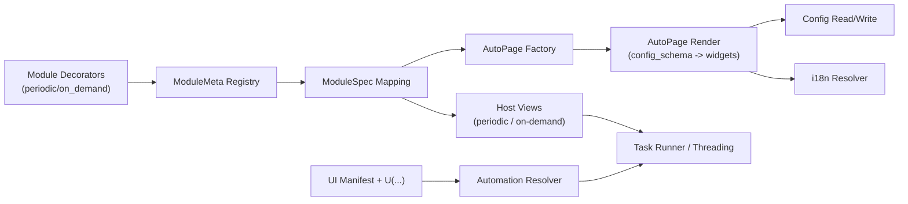

# SAA 开发者手册（2026 AutoPage 协议版）

> 本文档是当前代码协议的唯一中文基线，重点覆盖 **模块声明 → AutoPage 自动生成 UI → 宿主接入 → i18n 工具链** 的完整契约。
> 旧文档中基于 `@module(...)`、`AutoPageBase` 固定左右分栏等描述已经过时，以下内容均以当前源码为准。

---

## 0. 快速导览

本节产出：按你的角色快速找到可执行章节，减少无关阅读成本。

- 我是模块开发者：先看 `3 -> 5 -> 6 -> 15 -> 16`
- 我要进行国际化适配 i18n 贡献问题：先看 `7 -> 11 -> 14`
- 我要修UI问题（AutoPage）：先看 `6 -> 9 -> 10 -> 14`
- 我要改进自动化技术（`U`/manifest）：先看 `18 -> 14 -> 16`

---

## 1. 适用范围与目标

本节产出：理解本文档的适用边界与评判标准，避免在 framework 引入业务兜底。

本文档解决三个问题：

1. 新模块如何声明，才能被框架发现、注册、自动生成 UI 并稳定运行。
2. AutoPage（自动生成UI功能）的字段/控件/布局/i18n（国际化）/action 是如何推断与绑定的。
3. 框架如何“只提供通用能力，不引入具体游戏业务逻辑”。

核心原则：

- 声明式：模块只声明协议，框架负责通用装配。
- 宿主解耦：periodic （周期性任务） 与 on-demand （非周期性任务、即时任务）在各自 AutoPage 中定义页面行为差异。
- i18n 前置：声明文本与 UI 文本走统一提取与审计链路，不在业务里兜底语言问题。
- 类型优先：配置读写按字段类型做可逆转换，避免 UI/配置错位。

### 1.1 核心原则（务实版）

- 先可运行再优化：优先保证可编译、可发现、可执行，再迭代抽象。
- 框架加能力，不加业务：通用规则写 framework，任务语义留在 module。
- 兼容优先于重写：优先通过统一协议演进，避免大面积手工特判迁移。

---

## 2. 当前模块系统总览

本节产出：建立模块系统、AutoPage、宿主、i18n、自动化之间的协作心智模型。

### 2.1 顶层角色

- `app/framework/core/module_system`：模块声明、发现、注册、schema 生成。
- `app/framework/ui/auto_page`：AutoPage 自动 UI 生成与字段读写。
- `app/framework/application/modules`：将 `ModuleMeta` 转为宿主可消费的 `ModuleSpec`。
- `app/framework/ui/views/*`：periodic/on-demand 宿主页面，负责页面挂载与任务执行控制。
- `scripts/i18n_check.py`：i18n 全链路检查（extract/normalize/seed/audit/guard）。

### 2.2 运行时数据流

1. 装饰器注册 `ModuleMeta`。
2. 注册中心懒发现模块（首次访问时扫描 `app.features.modules`）。
3. `ModuleMeta` 映射为 `ModuleSpec`。
4. 宿主页面调用 `ui_factory` 构建页面（默认 AutoPage）。
5. AutoPage 按 `config_schema` 渲染字段并读写 `config`。
6. 宿主按 `ui_bindings` 查找页面/按钮/日志/卡片，接入执行器。

### 2.3 架构一图流



---

## 3. 模块声明协议（最新）

本节产出：按声明协议新增模块且一次通过发现、注册、UI 生成与运行注入。

### 3.1 只能使用的声明装饰器

当前有效装饰器：

- `@periodic_module(...)`
- `@on_demand_module(...)`
- `@module_page(module_id)`（可选，绑定自定义页面类）

旧的 `@module(...)` 不再是当前协议基线。

### 3.2 装饰器签名

```python
@periodic_module(
    name: str,
    *,
    fields: dict[str, str | Field] | None = None,
    actions: dict[str, str] | None = None,
    module_id: str | None = None,
    description: str = "",
)
```

`@on_demand_module(...)` 参数同上。

### 3.3 声明文本约束（强校验）

声明期会校验以下文本必须为英文 ASCII（用于统一 i18n 抽取源）：

- 模块 `name`
- `fields` 中 label/help
- `actions` 的按钮 label
- `Field.options` 中显式 label（如果提供）

违反时直接抛 `ValueError`，不会注册模块。

### 3.4 `Field` 协议

`Field` 是字段声明元数据，当前定义：

```python
@dataclass(frozen=True, slots=True)
class Field:
    id: str | None = None
    label: str | None = None
    help: str | None = None
    group: str | None = None
    layout: Literal["full", "half", "row"] = "full"
    icon: str | None = None
    description_md: str | None = None
    options: tuple[Any, ...] | None = None
```

关键规则：

- `id` 用于稳定 i18n key（建议稳定不改）。
- `label` 可省略：省略时优先用 `id`（再退回参数名）做人类化标签。
- `help` 对应字段说明文本。
- `layout` 控制字段在组内布局（是否可半宽由宿主 AutoPage 决定）。
- `options` 是声明期首选枚举来源（优先级高于 config validator）。

### 3.5 `actions` 协议

声明层当前约束是：

- `dict[按钮文案, 方法名]`
- 方法名必须是合法 Python 标识符

示例：

```python
actions={
    "Import": "on_import_codes_click",
    "Reset": "on_reset_codes_click",
}
```

说明：运行时 `AutoPageActionsMixin` 支持更丰富 spec（`group/order/primary`），但装饰器校验当前只允许字符串 method；如需开放 richer spec，应先扩展声明层校验协议。

### 3.6 模块 ID 推断与覆盖

模块 ID 解析顺序：

1. 显式 `module_id`
2. 包名映射表（periodic/on-demand 各自维护）
3. 类名推断 `CamelCase -> snake_case`
4. periodic 若无 `task_` 前缀会自动补 `task_`

因此，**不写 `module_id` 也可以稳定**，前提是包名在映射表中。

### 3.7 执行入口约束

- 声明类通常实现 `run(self)`。
- 注册时 `meta.runner` 取 `run` 方法；若无 `run`，runner 为 no-op。
- 运行注入由 `build_module_kwargs` 完成：优先 runtime_context，再 section config，再 root config，再默认值。

---

## 4. 模块发现与注册协议

本节产出：知道模块为什么会/不会被发现，以及注册冲突如何判定。

### 4.1 自动发现路径规则

只扫描满足以下条件的模块：

- 包路径包含 `.usecase.`
- 文件名叶子为 `*_usecase`

即：`app/features/modules/<module>/usecase/*_usecase.py`

### 4.2 发现策略

发现在首次访问注册中心时触发（懒加载），执行两套策略：

1. `pkgutil.walk_packages`
2. 文件系统递归（非 frozen 环境）

两者都执行，依赖 import cache 去重。

### 4.3 注册冲突规则

- 同 `id` 且 `runner` 不同：抛错 `Duplicate module id`。
- 同 `id` 且 `runner` 相同：可覆盖为同一对象（幂等）。

---

## 5. Config Schema 生成协议

本节产出：理解字段如何从构造器映射到 `SchemaField`，并控制 UI 暴露面。

来源：`build_config_schema(func, module_id, fields=None)`。

### 5.1 参数过滤

以下参数名会被排除，不进入 UI schema：

- 通用运行时：`self/cls/auto/automation/logger/app_config/config_provider/cancel_token/task_context`
- 其他保留：`islog`（大小写逻辑过滤）、前导 `_` 参数等

### 5.2 `fields` 的白名单语义

当声明了 `fields` 时：

- **只渲染 `fields` 中出现的构造参数**。
- 构造器中其余参数视为运行时/内部参数，不进 UI。

这是当前最重要的“显示面与运行面解耦”机制。

### 5.3 类型推断规则

- 有 annotation 直接用 annotation。
- annotation 缺失但有默认值：用默认值类型补推断。
- annotation 缺失且默认值为 `None`：跳过（无法可靠推断）。

### 5.4 `SchemaField` 生成结果

每个字段最终形成：

- `param_name`
- `field_id`
- `type_hint/default/required`
- `label_key/help_key`
- `label_default/help_default`
- `group/layout/icon/description_md/options`

标准 key 形态：

- `module.<module_id>.field.<field_id>.label`
- `module.<module_id>.field.<field_id>.help`

### 5.5 组和布局自动推断

若字段未显式指定 `group/layout`，按参数名与类型推断：

- 数值、枚举、下拉倾向 `half`
- 文本长内容倾向 `full`
- `<domain>_type` 自动形成 `<Domain> Settings` 组
- `*_upper/lower/min/max/base` 倾向 `Visual Calibration` 组

---

## 6. AutoPage 自动 UI 协议

本节产出：定位 UI 生成问题的根因入口（类型推断、布局、tips、读写、actions）。

## 6.1 页面类型

- `AutoPageBase`：公共渲染与字段读写能力。
- `PeriodicAutoPage`：periodic 宿主特化（无 start/log，tips 在底部，不允许半宽布局）。
- `OnDemandAutoPage`：on-demand 宿主特化（有 start/log，双栏布局，支持 background 模式隐藏 start）。

## 6.2 构建生命周期

`AutoPageBase.__init__` 固定顺序：

1. 初始化容器、scroll、actions bar、可选 start/log。
2. `_build_from_schema(config_schema)` 生成字段 UI。
3. `_build_actions()` 生成孤立 actions。
4. `_load_values()` 从 config 回填。
5. `_update_button_state(False)` 初始化按钮文本。

## 6.3 字段去重协议（语义去重）

会按“去前缀语义名”去重，前缀优先级：

`CheckBox > ComboBox > SpinBox > DoubleSpinBox > Slider > LineEdit > TextEdit`

示例：`CheckBox_x` 与 `ComboBox_x` 同时存在时，优先保留 `CheckBox_x`。

## 6.4 控件类型推断协议

核心函数：`_field_widget_kind(field)`。

优先级：

1. 参数名前缀强制：`ComboBox_/CheckBox_/Slider_/TextEdit_/DoubleSpinBox_`
2. `SpinBox_` 根据 hint/default 区分 int/float
3. `bool` 或“布尔样式 options” -> `CheckBox`(SwitchButton)
4. 有 options -> `ComboBox`
5. `Literal/Enum` -> `ComboBox`
6. `dict/list/tuple/set` -> 默认 `TextEdit`（`LineEdit_` 可强制单行）
7. 数值 -> `SpinBox/DoubleSpinBox`
8. 多行字符串默认 `TextEdit`
9. 其他 -> `LineEdit`

这条链路是“列表显示成索引、布尔被误判成下拉”等问题的根因入口。

## 6.5 options 解析协议

options 来源优先级：

1. `SchemaField.options`（来自 `Field.options`）
2. `config.<name>.options`
3. `config.<name>.validator.options`
4. `Literal` 候选
5. `Enum` 的 `value`
6. `field.default` 可迭代值（兜底）

每个 option 支持形态：

- 直接值：`"a"`、`1`
- 二元组：`(value, label)` 或 `(label, value)`（按类型推断）
- 字典：`{"value": ..., "label": ...}` 或单项映射

布尔 options（`0/1/true/false/on/off/yes/no` 且最多两项）会映射为 `SwitchButton`，而不是 `ComboBox`。

## 6.6 label/help/option 显示协议

- label：多候选 key 命中后取首个可用翻译，否则 fallback 到默认 label/humanize。
- help：先 key，再 default 文本翻译。
- option label：先 explicit label 翻译，再 option key 翻译，再原文。

## 6.7 字段布局协议

每个 group 渲染为：

- `StrongBodyLabel` 组标题
- `SimpleCardWidget + QFormLayout` 字段卡片

`half` 字段两两并排，单个落单时自动回退单行；`full` 独占一行。

Periodic 页会强制 `_allow_half_layout=False`，统一单列，避免宿主窄列截断。

## 6.8 tips 渲染协议

- tips 来源：`module_meta.description`（可 markdown）。
- `PeriodicAutoPage._tips_position() == "bottom"`：tips 永远在所有设置项之后。
- `OnDemand` 默认 top。

## 6.9 值加载/保存协议

### 加载

`_load_values()`：

- 读取 `config.<param>.value`，无配置项则使用 `field.default`
- 调用 `_set_widget_value` 做类型适配

### 保存

`_save_values()`：

- 读 widget 原值 `_get_widget_value`
- `_coerce_value_for_config` 按 hint/default/Literal/Enum 转换
- `config.set(cfg_item, typed_value)`

### 文本容器类型转换

- `dict/list/tuple/set` 支持 JSON 文本 + 逗号/换行拆分回填
- `tuple/set` 会从 list 转回目标容器
- bool/int/float 严格按目标类型转换

## 6.10 特殊通用能力：颜色预览

AutoPage 会在同组字段中自动识别 `*_upper/lower/min/max/base/current/preview` 颜色三元组，生成实时色块预览：

- 自动识别 HSV/RGB
- 回写后 `_update_color_previews()` 刷新显示

这是框架通用能力，不包含具体游戏业务语义。

## 6.11 改动边界（做/不做）

| 类别 | 可以做（框架通用能力） | 不应做（业务兜底） |
| --- | --- | --- |
| 字段渲染 | 类型推断、控件映射、值转换、布局算法 | 针对某个任务字段名写死特殊逻辑 |
| i18n | 候选 key 回退、乱码过滤、tips 规范化 | `if module_id == xxx` 强行替换文案 |
| 宿主适配 | periodic/on-demand 页面行为差异 | 在 base 层写死某游戏任务流程 |
| actions | 通用注入上下文与签名适配 | 业务动作流程搬到 framework |

---

## 7. AutoPage i18n 协议

本节产出：快速判断“英文残留/中文错位/乱码”属于 key、回退还是数据清理问题。

来源：`AutoPageI18nMixin`。

### 7.1 模块 i18n ID 集合

`_module_i18n_ids()` 会组合：

1. 当前 `module_meta.id`
2. 去 `task_` 后别名
3. owner slug（目录名）
4. 模块名 snake key
5. 同 owner/same class 的 related module ids

因此可覆盖“task_xxx / xxx / 包名别名”多历史 key。

### 7.2 脏翻译过滤

`_is_unusable_translated_text` 会过滤：

- 空串
- 含 `�`
- 全问号/乱码样式
- 明显 mojibake

命中后继续 fallback，避免把乱码展示到 UI。

### 7.3 tips key 候选

优先尝试：

- `module.<id>.description`
- `module.<id>.ui.description`
- `module.<id>.ui.tips`
- `module.<id>.ui.tips_*`（历史兼容）

最终会规范化 markdown：去冗余空行、`-` 统一为 `*`。

### 7.4 action 文案 key 候选

- `module.<id>.action.<action_id>.label`
- `module.<id>.ui.<action_id>`
- `module.<id>.ui.<snake(label)>`
- fallback 为声明 label

---

## 8. Action 调用协议（AutoPage）

本节产出：确保 action 按钮显示、分组、调用、回显全过程可预测。

来源：`AutoPageActionsMixin`。

### 8.1 按钮生成

`module_meta.actions` 会转成 action specs，并按 `group/order/label` 排序。

分组策略：

- 显式 `group` 优先
- 无 group 时做 token overlap 自动归组
- 无法归组时作为 orphan action 放页面底部 `actions_bar`

### 8.2 调用前后行为

点击 action 时：

1. 先 `_save_values()`（确保动作读到最新配置）
2. 反射调用方法（实例方法会自动构建 action instance）
3. 若返回字符串，写入日志面板
4. `_load_values()`（允许 action 侧改 config 后回显）

### 8.3 action 方法可接收上下文参数

框架注入候选 kwargs：

- `page`
- `host`
- `module_meta`
- `config`
- `logger`
- `button`
- `field_widgets`

实际调用时会按方法签名筛选，只传可接收参数（或 `**kwargs` 全接）。

---

## 9. 宿主接入协议

本节产出：正确完成 AutoPage 与 periodic/on-demand 宿主的页面挂载与执行绑定。

## 9.1 `ModuleSpec` / `ModuleUiBindings`

宿主消费结构：

```python
@dataclass(frozen=True)
class ModuleUiBindings:
    page_attr: str
    start_button_attr: Optional[str]
    card_widget_attr: Optional[str]
    log_widget_attr: Optional[str]
```

```python
@dataclass(frozen=True)
class ModuleSpec:
    id: str
    zh_name: str
    en_name: str
    order: int
    hosts: tuple[HostContext, ...]
    ui_factory: Callable[[object, HostContext], object]
    module_class: Optional[type]
    ui_bindings: Optional[ModuleUiBindings]
    passive: bool
    on_demand_execution: Literal["exclusive", "background"]
```

### 9.2 `ui_factory` 默认行为

若模块未提供自定义 page：

- 自动使用 `build_auto_page(...)`
- periodic -> `PeriodicAutoPage`
- on-demand -> `OnDemandAutoPage`

### 9.3 periodic 宿主控件查找协议

`PeriodicTasksView.get_module_widget(widget_attr)` 查找顺序：

1. `getattr(page, widget_attr)`
2. `page.field_widgets[widget_attr]`
3. `page.findChild(QWidget, widget_attr)`

并带缓存 `_module_widget_cache`。

这保证了旧控件名与 AutoPage 新字段映射的兼容层。

### 9.4 periodic 设置持久化协议

- 统一由 `PeriodicUiBindingUseCase.connect_config_bindings` 绑定变更信号。
- `PeriodicSettingsUseCase.persist_widget_change` 负责类型化落盘。
- shopping 特殊选择器通过注入 `ShoppingSelectionFactory` 独立接入。

### 9.5 on-demand 执行策略协议

`on_demand_execution` 支持：

- `exclusive`：普通互斥单任务执行
- `background`：后台常驻开关型执行

背景任务判定：

1. 若模块类有 `should_background_run(config)`/`should_background_run()`，优先调用。
2. 否则扫描页面 schema 中所有 `CheckBox_*`，任意 true 则认为应运行。

`OnDemandAutoPage` 在 background 策略下会隐藏模块内 start 按钮。

### 9.6 Host 差异最小记忆卡

- periodic：无模块内 start、无本地 log、tips 在底部、默认单列布局。
- on-demand（exclusive）：有 start、有本地 log，可单任务启停。
- on-demand（background）：模块内 start 可隐藏，开关状态驱动后台线程。
- 宿主查控件顺序：`attr -> field_widgets -> findChild`（periodic 提供缓存）。

---

## 10. periodic 与 on-demand 页面结构差异（当前协议）

本节产出：明确布局职责归属，避免把宿主特性错误塞回 `AutoPageBase`。

### 10.1 AutoPageBase 不再承担固定左右分栏

`AutoPageBase` 只提供通用垂直容器（scroll + actions + 可选 start/log）。

### 10.2 OnDemand 的左右分栏属于 OnDemandAutoPage

`OnDemandAutoPage._mount_split_layout()` 负责：

- 左：设置 scroll + actions + start
- 右：本地 log card

这符合“base 不持有宿主特有布局”的解耦原则。

### 10.3 Periodic 保持纯设置面板

`PeriodicAutoPage`：

- 无 start
- 无本地 log
- tips 在底部
- 禁止 half 布局
- 默认过滤非 UI 字段：`update_data/task_name/used_codes`

---

## 11. i18n 工具链协议（必须执行）

本节产出：按统一流水线清理遗留 key、补全翻译并阻断新债务。

统一入口：`python scripts/i18n_check.py`

执行顺序：

1. `extract_module_i18n.py`
2. `normalize_i18n_data.py`
3. `seed_i18n_missing.py`
4. `audit_i18n.py --fail-on-issues`
5. `ui_sync.py --audit --fail-on-issues`
6. `i18n_guard.py`

### 11.1 extract 协议

从装饰器与 `_()` 调用提取：

- `module.<id>.title`
- `module.<id>.field.<field_id>.label/help`
- 动态模板元数据（template/meta/source_map）

### 11.2 normalize 协议

会做以下清理与归并：

- 中文后缀 key 规范化
- source-of-truth 归位
- hashlike/static 重复键合并
- 过期 tips alias 清理：`module.<id>.ui.tips_* -> module.<id>.description`
- 删除 `zh_TW.json` 遗留

这就是“description 已替换但旧 tips key 仍残留”的底层清理路径。

### 11.3 audit/guard 协议

- 校验语言覆盖、模板字段一致性、owner 漂移、结构正确性。
- 阻断新增 i18n 技术债（包括错误目录、非规范 key 等）。

### 11.4 什么时候跑哪些脚本

| 变更类型 | 最低命令 | 目的 |
| --- | --- | --- |
| 只改文案/翻译 | `python scripts/i18n_check.py` | 抽取、归一化、审计与守卫 |
| 改 UI 资源（`ui.json`/图像定位） | `python scripts/ui_sync.py --audit` | 检查 unresolved、冲突与漂移 |
| 改模块声明/AutoPage 行为 | `python scripts/smoke_modules.py` + `python scripts/i18n_check.py` | 同时验证运行与文案链路 |

---

## 12. 开发规范：如何只加框架通用能力

本节产出：在迭代功能时守住“框架通用能力”边界，减少未来迁移成本。

### 12.1 可以做的

- 在 `AutoPageBase` 增强通用类型识别、布局算法、候选 key 解析、读写转换。
- 在 `PeriodicAutoPage/OnDemandAutoPage` 增强宿主差异行为（不触及模块业务）。
- 在 `module_system` 增强声明能力与 schema 生成规则。

### 12.2 不应做的

- 在 framework 层写死某个游戏任务名、角色名、业务流程判断。
- 用“模块特判 if module_id == xxx”兜底 UI/i18n 错误。
- 在宿主层硬编码模块字段含义（除历史兼容桥接过渡）。

### 12.3 `Field.id` 与 `Field.label` 的建议

当前协议允许：

- 只写 `id`，不写 `label`
- 只写 `label`，不写 `id`
- 两者都写

推荐在大多数场景：

- 保持稳定 `id`
- `label` 可省略，由框架以 `id` 自动人类化

这样可减少重复配置，降低维护成本。

---

## 13. 迁移旧协议（`@module`）到新协议

本节产出：用最短路径完成旧模块迁移并通过最低回归检查。

1. 把 `@module(host=...)` 替换为 `@periodic_module` 或 `@on_demand_module`。
2. 校正声明文本为英文 ASCII。
3. 若构造器含内部参数，显式使用 `fields` 做 UI 白名单。
4. 删除模块内手工控件找值逻辑，改用构造参数 + config 注入。
5. 运行：
   - `python -m compileall app`
   - `python scripts/smoke_modules.py`
   - `python scripts/i18n_check.py`

---

## 14. 排障手册（面向 AutoPage）

本节产出：按“症状 -> 根因入口 -> 第一命令”快速定位高频问题。

### 14.0 故障速查（先看这个）

| 症状 | 根因入口 | 第一条命令 |
| --- | --- | --- |
| tips/按钮文案出现英文 | `7` 与 `11`（key 回退/残留 alias） | `python scripts/i18n_check.py` |
| 下拉显示 0/1 或数字索引 | `6.4/6.5`（类型与 options 解析） | `python scripts/smoke_modules.py` |
| 按钮显示但点击无效 | `8`（method 绑定/签名）与 `9`（宿主绑定） | `python scripts/smoke_modules.py` |
| periodic 页面显示不全 | `10` 与 `6.7`（布局职责/列策略） | `python -m compileall app` |
| 自动化点击找不到目标 | `18`（U/manifest 解析） | `python scripts/ui_sync.py --audit` |

### 14.1 下拉显示 0/1 或索引数字

根因通常是：

- options 来源只剩索引（ComboBox 以 `currentIndex` 持久化）
- 字段应为 bool/list 文本却被错误识别为 Combo

排查点：

1. `Field.options` 是否声明了 value/label。
2. `config.<field>.options` / `validator.options` 是否只有数字。
3. `_field_widget_kind` 是否命中布尔 options 分支。

### 14.2 中文/英文混乱或 tips 变英文

排查顺序：

1. `module.<id>.description` 是否存在且归属 owner 正确。
2. 是否存在过期 `module.<id>.ui.tips_*` 冲突键。
3. `_module_i18n_ids()` 候选是否能覆盖当前模块别名。
4. 跑 `python scripts/i18n_check.py` 看 normalize/audit 报告。

### 14.3 action 按钮存在但无功能

排查点：

1. `actions` method 名是否真实存在于模块类。
2. 方法签名是否接受注入参数（或 `**kwargs`）。
3. 是否被宿主误重复绑定（可检查 objectName 前缀 `PushButton_action_`）。

### 14.4 periodic 页面布局被裁切

优先检查：

- 是否仍依赖旧 base 的宿主特有布局。
- periodic 中是否错误使用 half 并排（当前协议默认禁用）。
- 模块是否把 on-demand UI 布局逻辑写进了通用 base。

---

## 15. 最小声明示例（推荐写法）

本节产出：复制即可得到符合当前协议的最小可运行模块声明样式。

```python
from app.framework.core.module_system import Field, periodic_module

@periodic_module(
    "Auto Login",
    description="### Tips\n* Select your server first\n* Enable auto-open if needed",
    fields={
        "CheckBox_open_game_directly": Field(id="open_game_directly"),
        "LineEdit_game_directory": Field(id="game_directory"),
    },
    actions={
        "Tutorial": "show_path_tutorial",
        "Browse": "select_game_directory",
    },
)
class EnterGameModule:
    def __init__(
        self,
        auto,
        logger,
        CheckBox_open_game_directly: bool = False,
        LineEdit_game_directory: str = "./",
    ):
        self.auto = auto
        self.logger = logger
        self.auto_open_game = bool(CheckBox_open_game_directly)
        self.game_directory = str(LineEdit_game_directory)

    def run(self):
        ...
```

---

## 16. 发布前检查清单

本节产出：发布前统一最低质量门槛，减少“能跑但不可维护”的提交。

1. 装饰器是否为 `@periodic_module/@on_demand_module`。
2. 声明文本是否英文 ASCII。
3. `fields` 是否正确约束 UI 暴露面。
4. AutoPage 渲染是否符合宿主（periodic 不应出现模块内 start）。
5. `python scripts/smoke_modules.py` 全量通过。
6. `python scripts/i18n_check.py` 无阻断问题。
7. 不存在模块特判式 framework 逻辑。

### 16.1 最低回归门槛（不可跳过）

```bash
python -m compileall app
python scripts/smoke_modules.py
python scripts/i18n_check.py
```

---

## 17. 文档维护规则

本节产出：确保协议变更与文档同步，避免文档再次过时。

- 任何协议变更（字段类型推断、actions 声明结构、i18n key 解析顺序、宿主绑定行为）都必须同步更新本文档。
- 若源码与文档冲突，以源码为准，并在同次提交更新本文档。
- 新增能力优先抽象为通用协议，不在 framework 写业务兜底。
- 若改动涉及以下任一项，PR 必须同步更新对应章节：装饰器参数、字段类型映射、i18n key 解析顺序、host 绑定规则、`U`/manifest 解析规则。

---

## 18. 自动化 `U` 对象协议（UI Manifest）

本节产出：稳定使用 `U` 与 manifest 协议完成 UI 资源定位、解释和点击执行。

`U` 是自动化层的统一 UI 引用构造器，定义于：

- `app/framework/infra/ui_manifest/__init__.py`

目标是把“字符串/图片/ROI/OCR 参数”的松散调用，收敛成可追踪、可解析、可审计的统一对象协议。

### 18.1 `U(...)` 接口签名

```python
def U(
    text_or_id: str,
    *,
    id: str | None = None,
    roi: tuple[float, float, float, float] | None = None,
    image: str | None = None,
    threshold: float | None = None,
    include: bool | None = None,
    need_ocr: bool | None = None,
    find_type: str | None = None,
    **kwargs,
) -> UIReference | UIDefinition
```

### 18.2 返回对象判定规则

`U(...)` 返回 `UIReference` 还是 `UIDefinition` 由参数形态决定：

1. 若存在任一“定义型参数”（`id/image/roi/threshold/find_type`）则返回 `UIDefinition`。
2. 否则返回 `UIReference`（典型场景：`U("start")`）。

额外规则：

- `inferred_id = id or text_or_id(不含路径分隔符时)`。
- `inferred_text = text_or_id if id else None`。
- 定义型文本默认写入 `text={"zh_CN": text_or_id}`，`kind` 自动推断为 `text/image`。
- 会自动带上调用点 `source_file/source_line`，用于 explain 与问题定位。

### 18.3 `Automation` 对 `U` 的消费入口

来源：`app/framework/infra/automation/automation.py`

`Automation._resolve_ui_click(...)` 支持三类输入：

1. `UIReference`
2. `UIDefinition`
3. `str`（内部会转成 `U(...)`）

解析输出统一为 `ResolvedUIObject`，包含：

- `target/find_type/roi/threshold/include/need_ocr`
- `text/image_path`
- `trace/explain_trace/resolution_trace`
- `module_name/locale`

### 18.4 与 `auto.click` / `auto.find` / `auto.explain` 的关系

#### `auto.click(ref_or_id, **kwargs)`

- 先走 `_resolve_ui_click`。
- 成功后调用底层 `click_element(...)` 执行。
- 解析失败抛 `UIResolveError` 时，框架记录失败日志并返回 `False`（不中断线程）。

推荐写法：

```python
self.auto.click(U("开始", id="start", roi=(0.1, 0.2, 0.3, 0.4)))
self.auto.click("start")
```

#### `auto.find_element(...)` / `auto.find(...)`

- 兼容旧接口。
- 当 `target` 是符合 ID 规则的短字符串（且不是图片后缀）时，会尝试按 `U(id)` 走 manifest 解析。
- 解析失败再按旧 text/image 逻辑继续，不破坏旧代码可运行性。

#### `auto.explain(ref_or_id, **kwargs)`

- 只做解析，不点击。
- 返回结构化解释结果（`ok/layer/code/detail/trace/...`），用于排障和调试 manifest。

### 18.5 `UIResolver` 解析协议

解析链路：

1. 根据调用点生成 `ModuleContext`（模块目录、assets 路径、callsite）。
2. 加载 `ui.generated.json` + `ui.json` 快照（`ManifestEngine.load`）。
3. 按 `id` 选定义、叠加 reference override。
4. 解析 `position/roi`，结合当前分辨率做坐标换算。
5. 生成 `ResolvedUIObject` 回传给自动化点击/查找层。

关键失败码（`UIResolveError.code`）：

- `resolve/id_not_registered`
- `resolve/empty_target`
- 以及其他 `resolve/*`、`match/*`、`execute/*` 分层错误

如果 `id` 未注册，解析器会把发现项写入 generated manifest（discovered definition）并上报事件，随后抛错提示补全定义。

### 18.6 与 UI 资源文件的契约

- 人工维护：`app/features/modules/<module>/assets/ui.json`
- 运行/生成视图：`app/features/modules/<module>/assets/ui.generated.json`

同步与审计命令：

- `python scripts/ui_sync.py --write`
- `python scripts/ui_sync.py --audit`

`i18n_check.py` 也会串联 `ui_sync --audit --fail-on-issues`，因此 U/manifest 约束属于发布前必检项。

### 18.7 推荐实践

1. 新代码优先使用 `auto.click(U(...))` 或 `auto.click("id")`，避免裸字符串 OCR 目标散落。
2. `id` 语义化且稳定，不把模块业务文案直接当长期 ID。
3. 需要临时覆写阈值/ROI 时，使用 `U(..., threshold=..., roi=...)` 覆盖，不改底层资源定义。
4. 复杂定位先 `auto.explain(...)` 看 trace，再修资源文件，不要直接业务代码硬编码补丁。
