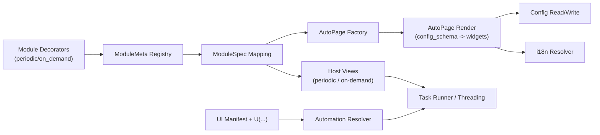

# SAA Developer Manual

> This document is the sole current Chinese baseline for the code contract, focusing on the complete contract of **module declaration → AutoPage automatic UI generation → host integration → i18n toolchain**.
> Descriptions in older documents based on `@module(...)`, `AutoPageBase` fixed left-right split layout, and similar mechanisms are now outdated. All content below is based on the current source code.

---

## 0. Quick Navigation

Deliverable of this section: quickly locate the actionable chapters based on your role, reducing irrelevant reading cost.

* I am a module developer: See 3 -> 5 -> 6 -> 15 -> 16 first
* I want to contribute to i18n adaptation issues: See 7 -> 11 -> 14 first
* I want to fix UI issues (AutoPage): See 6 -> 9 -> 10 -> 14 first
* I want to improve automation technology (U/manifest): See 18 -> 14 -> 16 first


---

## 1. Scope and Objectives

Deliverable of this section: understand the applicability boundary and evaluation criteria of this document, and avoid introducing business-specific fallback logic into the framework.

This document solves three problems:

1. How a new module should be declared so that it can be discovered by the framework, registered, automatically generate UI, and run stably.
2. How AutoPage infers and binds fields/widgets/layout/i18n/actions.
3. How to ensure that “the framework only provides generic capabilities without introducing specific game business logic,” while remaining compatible with other games in the future.

Core principles:

* Declarative: modules only declare the contract; the framework is responsible for generic assembly.
* Host decoupling: periodic and on-demand define page behavior differences within their respective AutoPages.
* i18n first: declaration text and UI text go through a unified extraction and audit pipeline, rather than patching language issues in business code.
* Type first: config read/write uses reversible conversion based on field types to avoid UI/config mismatches.

### 1.1 Core Principles (Pragmatic Version)

* Make it runnable first, optimize later: prioritize compilability, discoverability, and executability, then iterate on abstraction.
* Add capabilities to the framework, not business logic: generic rules belong in the framework, task semantics remain in the module.
* Compatibility takes priority over rewrites: prefer evolving through a unified contract, and avoid large-scale manual special-case migration.

---

## 2. Overview of the Current Module System

Deliverable of this section: build a mental model of how the module system, AutoPage, host, i18n, and automation collaborate.

### 2.1 Top-Level Roles

* `app/framework/core/module_system`: module declaration, discovery, registration, schema generation.
* `app/framework/ui/auto_page`: AutoPage automatic UI generation and field read/write.
* `app/framework/application/modules`: converts `ModuleMeta` into host-consumable `ModuleSpec`.
* `app/framework/ui/views/*`: periodic/on-demand host pages, responsible for page mounting and task execution control.
* `scripts/i18n_check.py`: full i18n pipeline checks (extract/normalize/seed/audit/guard).

### 2.2 Runtime Data Flow

1. Decorators register `ModuleMeta`.
2. The registry lazily discovers modules (scans `app.features.modules` on first access).
3. `ModuleMeta` is mapped to `ModuleSpec`.
4. The host page calls `ui_factory` to build the page (AutoPage by default).
5. AutoPage renders fields from `config_schema` and reads/writes `config`.
6. The host uses `ui_bindings` to locate pages/buttons/logs/cards and connects them to the executor.

### 2.3 Architecture in One Diagram



---

## 3. Module Declaration Contract (Latest)

Deliverable of this section: add a new module according to the declaration contract and pass discovery, registration, UI generation, and runtime injection in one go.

### 3.1 The Only Supported Declaration Decorators

Currently valid decorators:

* `@periodic_module(...)`
* `@on_demand_module(...)`
* `@module_page(module_id)` (optional, binds a custom page class)

The old `@module(...)` is no longer the baseline of the current contract.

### 3.2 Decorator Signature

```python
@periodic_module(
    name: str,
    *,
    fields: dict[str, str | Field] | None = None,
    actions: dict[str, str] | None = None,
    module_id: str | None = None,
    description: str = "",
)
```

```python
@on_demand_module(
    name: str,
    *,
    fields: dict[str, str | Field] | None = None,
    actions: dict[str, str] | None = None,
    module_id: str | None = None,
    execution: Literal["exclusive", "background"] | None = None,
    background_keys: tuple[str, ...] | list[str] | str | None = None,
    description: str = "",
)
```

### 3.2.1 Declaration Example: `drink` (Chinese title: `猜心对局`)

```python
from app.framework.core.module_system import Field, on_demand_module

@on_demand_module(
    "Drink",
    fields={
        "ComboBox_drink_person": Field(id="drink_person"),
        "ComboBox_drink_mode": Field(id="drink_mode"),
        "CheckBox_drink_auto_buy_stamina": Field(id="auto_buy_stamina"),
    },
    description="### Tips\n* Automates the Card Match mini-game for passive farming.",
)
class DrinkModule:
    ...
```

### 3.3 Declaration Text Constraints (Strict Validation)

At declaration time, the following text is validated and must be English ASCII (used as the unified i18n extraction source):

* module `name`
* `fields` label/help
* `actions` button labels
* explicit labels in `Field.options` (if provided)

Violation raises `ValueError` directly, and the module will not be registered.

### 3.4 `Field` Contract

`Field` is the field declaration metadata. Its current definition is:

```python
@dataclass(frozen=True, slots=True)
class Field:
    id: str | None = None
    label: str | None = None
    help: str | None = None
    group: str | None = None
    layout: Literal["full", "half", "row"] = "full"
    icon: str | None = None
    description_md: str | None = None
    options: tuple[Any, ...] | None = None
```

Key rules:

* `id` is used for stable i18n keys (it is recommended to keep it stable).
* `label` may be omitted: when omitted, `id` is preferred (then the parameter name as fallback) to generate a humanized label.
* `help` corresponds to the field help text.
* `layout` controls the field layout inside a group (whether half width is allowed depends on the host AutoPage).
* `options` is the preferred enum source at declaration time (higher priority than config validators).

### 3.5 `actions` Contract

The current declaration-layer constraint is:

* `dict[button_label, method_name]`
* method name must be a valid Python identifier

Example:

```python
actions={
    "Import": "on_import_codes_click",
    "Reset": "on_reset_codes_click",
}
```

Note: at runtime, `AutoPageActionsMixin` supports richer specs (`group/order/primary`), but decorator validation currently only allows string methods. If richer specs are to be enabled, the declaration-layer validation contract must be extended first.

### 3.6 Module ID Inference and Override

Module ID resolution order:

1. Explicit `module_id`
2. Package-name mapping table (maintained separately for periodic/on-demand)
3. Class-name inference `CamelCase -> snake_case`
4. For periodic modules, `task_` is automatically prefixed if absent

Therefore, **omitting `module_id` can still be stable**, provided the package name is in the mapping table.

### 3.7 Execution Entry Constraints

* The declared class usually implements `run(self)`.
* During registration, `meta.runner` takes the `run` method; if no `run` exists, the runner is a no-op.
* Runtime injection is handled by `build_module_kwargs`: priority is runtime_context, then section config, then root config, then default values.

---

## 4. Module Discovery and Registration Contract

Deliverable of this section: understand why a module is or is not discovered, and how registration conflicts are determined.

### 4.1 Automatic Discovery Path Rules

Only modules satisfying the following conditions are scanned:

* package path contains `.usecase.`
* file leaf name matches `*_usecase`

That is: `app/features/modules/<module>/usecase/*_usecase.py`

### 4.2 Discovery Strategy

Discovery is triggered on first access to the registry (lazy loading), using two strategies:

1. `pkgutil.walk_packages`
2. recursive filesystem traversal (non-frozen environments)

Both are executed, and duplicates are removed via import cache.

### 4.3 Registration Conflict Rules

* Same `id` but different `runner`: raises `Duplicate module id`.
* Same `id` and same `runner`: may collapse to the same object (idempotent).

---

## 5. Config Schema Generation Contract

Deliverable of this section: understand how fields are mapped from constructor parameters to `SchemaField`, and how to control UI exposure.

Source: `build_config_schema(func, module_id, fields=None)`.

### 5.1 Parameter Filtering

The following parameter names are excluded and do not enter the UI schema:

* common runtime parameters: `self/cls/auto/automation/logger/app_config/config_provider/cancel_token/task_context`
* other reserved names: `islog` (case-based filtering), leading `_` parameters, etc.

### 5.2 Whitelist Semantics of `fields`

When `fields` is declared:

* **Only constructor parameters appearing in `fields` are rendered**.
* Other constructor parameters are treated as runtime/internal parameters and do not enter the UI.

This is currently the most important mechanism for decoupling the “display surface” from the “runtime surface.”

### 5.3 Type Inference Rules

* If an annotation exists, use it directly.
* If the annotation is missing but a default value exists, infer from the default value type.
* If the annotation is missing and the default value is `None`, skip it (cannot be inferred reliably).

### 5.4 `SchemaField` Generation Result

Each field ultimately forms:

* `param_name`
* `field_id`
* `type_hint/default/required`
* `label_key/help_key`
* `label_default/help_default`
* `group/layout/icon/description_md/options`

Standard key format:

* `module.<module_id>.field.<field_id>.label`
* `module.<module_id>.field.<field_id>.help`

### 5.5 Automatic Group and Layout Inference

If a field does not explicitly specify `group/layout`, it is inferred from parameter name and type:

* numeric, enum, and dropdown fields tend toward `half`
* long text content tends toward `full`
* `<domain>_type` automatically forms a `<Domain> Settings` group
* `*_upper/lower/min/max/base` tend toward a `Visual Calibration` group

---

## 6. AutoPage Automatic UI Contract

Deliverable of this section: locate the root cause entry points of UI generation issues (type inference, layout, tips, read/write, actions).

## 6.1 Page Types

* `AutoPageBase`: common rendering and field read/write capabilities.
* `PeriodicAutoPage`: periodic host specialization (no start/log, tips at the bottom, half-width layout not allowed).
* `OnDemandAutoPage`: on-demand host specialization (has start/log, split layout, supports hiding start in background mode).

### 6.1.1 AutoPage Example: `drink`

With the declaration above, AutoPage resolves widgets as follows by default:

* `ComboBox_drink_person` -> dropdown (`ComboBox`)
* `ComboBox_drink_mode` -> dropdown (`ComboBox`)
* `CheckBox_drink_auto_buy_stamina` -> boolean switch (`SwitchButton`)

If no custom page is provided, on-demand host uses `OnDemandAutoPage` and applies split layout + local log panel.

## 6.2 Build Lifecycle

`AutoPageBase.__init__` follows a fixed order:

1. Initialize container, scroll, actions bar, and optional start/log.
2. `_build_from_schema(config_schema)` generates field UI.
3. `_build_actions()` generates orphan actions.
4. `_load_values()` fills values back from config.
5. `_update_button_state(False)` initializes button text.

## 6.3 Field Deduplication Contract (Semantic Deduplication)

Deduplication is performed by “semantic name after prefix stripping,” with prefix priority:

`CheckBox > ComboBox > SpinBox > DoubleSpinBox > Slider > LineEdit > TextEdit`

Example: if both `CheckBox_x` and `ComboBox_x` exist, `CheckBox_x` is retained first.

## 6.4 Widget Type Inference Contract

Core function: `_field_widget_kind(field)`.

Priority:

1. forced by parameter-name prefix: `ComboBox_/CheckBox_/Slider_/TextEdit_/DoubleSpinBox_`
2. `SpinBox_` distinguishes int/float based on hint/default
3. `bool` or “boolean-style options” -> `CheckBox` (`SwitchButton`)
4. has options -> `ComboBox`
5. `Literal/Enum` -> `ComboBox`
6. `dict/list/tuple/set` -> default `TextEdit` (`LineEdit_` can force single-line)
7. numeric -> `SpinBox/DoubleSpinBox`
8. multi-line string defaults to `TextEdit`
9. otherwise -> `LineEdit`

This path is the root-cause entry point for issues such as “lists displayed as indices” and “booleans misclassified as dropdowns.”

## 6.5 options Parsing Contract

Option source priority:

1. `SchemaField.options` (from `Field.options`)
2. `config.<name>.options`
3. `config.<name>.validator.options`
4. `Literal` candidates
5. `Enum` values
6. iterable `field.default` (fallback)

Supported option forms:

* direct value: `"a"`, `1`
* tuple: `(value, label)` or `(label, value)` (type-inferred)
* dict: `{"value": ..., "label": ...}` or single-entry mapping

Boolean options (`0/1/true/false/on/off/yes/no` and at most two items) are mapped to `SwitchButton`, not `ComboBox`.

## 6.6 label/help/option Display Contract

* label: after trying multiple candidate keys, use the first available translation; otherwise fall back to default label/humanize.
* help: key first, then translate the default text.
* option label: explicit label translation first, then option key translation, then original text.

## 6.7 Field Layout Contract

Each group is rendered as:

* `StrongBodyLabel` group title
* `SimpleCardWidget + QFormLayout` field card

`half` fields are arranged side by side in pairs; if a single one is left over, it automatically falls back to a single row. `full` occupies an entire row.

Periodic pages force `_allow_half_layout=False`, using a single column uniformly to avoid truncation in narrow host columns.

## 6.8 tips Rendering Contract

* source of tips: `module_meta.description` (may be markdown).
* `PeriodicAutoPage._tips_position() == "bottom"`: tips always appear after all settings.
* `OnDemand` defaults to top.

## 6.9 Value Load/Save Contract

### Load

`_load_values()`:

* reads `config.<param>.value`; if no config item exists, uses `field.default`
* calls `_set_widget_value` for type adaptation

### Save

`_save_values()`:

* reads raw widget value via `_get_widget_value`
* `_coerce_value_for_config` converts according to hint/default/Literal/Enum
* `config.set(cfg_item, typed_value)`

### Text Container Type Conversion

* `dict/list/tuple/set` support JSON text plus comma/newline split backfilling
* `tuple/set` are converted back from list to the target container
* `bool/int/float` are strictly converted to the target type

## 6.10 Special Generic Capability: Color Preview

AutoPage automatically identifies color triples such as `*_upper/lower/min/max/base/current/preview` within the same group and generates real-time color previews:

* automatically detects HSV/RGB
* refreshes display via `_update_color_previews()` after write-back

This is a generic framework capability and does not contain specific game business semantics.

## 6.11 Change Boundary (Do / Do Not)

| Category        | Acceptable (generic framework capability)                          | Not acceptable (business fallback)                     |
| --------------- | ------------------------------------------------------------------ | ------------------------------------------------------ |
| Field rendering | type inference, widget mapping, value conversion, layout algorithm | hardcoded special logic for a specific task field name |
| i18n            | candidate key fallback, mojibake filtering, tips normalization     | force-replacing copy with `if module_id == xxx`        |
| Host adaptation | behavior differences between periodic/on-demand pages              | hardcoding a specific game task flow in the base layer |
| actions         | generic context injection and signature adaptation                 | moving business action flow into the framework         |

---

## 7. AutoPage i18n Contract

Deliverable of this section: quickly determine whether “English remnants / Chinese misalignment / mojibake” is caused by keys, fallback, or data cleanup.

Source: `AutoPageI18nMixin`.

### 7.1 Module i18n ID Set

`_module_i18n_ids()` combines:

1. current `module_meta.id`
2. alias after removing `task_`
3. owner slug (directory name)
4. module name snake key
5. related module ids under the same owner / same class

Therefore it can cover many historical keys such as `task_xxx / xxx / package-name alias`.

### 7.2 Dirty Translation Filtering

`_is_unusable_translated_text` filters out:

* empty strings
* strings containing `�`
* all-question-mark / garbled styles
* obvious mojibake

If matched, fallback continues so that garbled text is not shown in the UI.

### 7.3 tips Key Candidates

Priority order:

* `module.<id>.description`
* `module.<id>.ui.description`
* `module.<id>.ui.tips`
* `module.<id>.ui.tips_*` (historical compatibility)

Markdown is normalized in the end: redundant blank lines are removed, and `-` is normalized to `*`.

### 7.4 action Copy Key Candidates

* `module.<id>.action.<action_id>.label`
* `module.<id>.ui.<action_id>`
* `module.<id>.ui.<snake(label)>`
* fallback is the declared label

---

## 8. Action Invocation Contract (AutoPage)

Deliverable of this section: ensure the full action button lifecycle—display, grouping, invocation, and feedback—is predictable.

Source: `AutoPageActionsMixin`.

### 8.1 Button Generation

`module_meta.actions` is converted into action specs and sorted by `group/order/label`.

Grouping strategy:

* explicit `group` takes priority
* when no `group` is given, token overlap is used for automatic grouping
* if grouping fails, it becomes an orphan action placed at the bottom `actions_bar`

### 8.2 Behavior Before and After Invocation

When an action is clicked:

1. `_save_values()` first (ensures the action reads the latest config)
2. invoke the method reflectively (instance methods automatically build an action instance)
3. if a string is returned, write it into the log panel
4. `_load_values()` (allows config changes made by the action side to be reflected back)

### 8.3 action Methods May Receive Context Parameters

Candidate kwargs injected by the framework:

* `page`
* `host`
* `module_meta`
* `config`
* `logger`
* `button`
* `field_widgets`

At actual call time, only parameters accepted by the method signature are passed (or all are passed if `**kwargs` is present).

---

## 9. Host Integration Contract

Deliverable of this section: correctly complete AutoPage mounting and execution binding with periodic/on-demand hosts.

## 9.1 `ModuleSpec` / `ModuleUiBindings`

Host-consumed structures:

```python
@dataclass(frozen=True)
class ModuleUiBindings:
    page_attr: str
    start_button_attr: Optional[str]
    card_widget_attr: Optional[str]
    log_widget_attr: Optional[str]
```

```python
@dataclass(frozen=True)
class ModuleSpec:
    id: str
    zh_name: str
    en_name: str
    order: int
    hosts: tuple[HostContext, ...]
    ui_factory: Callable[[object, HostContext], object]
    module_class: Optional[type]
    ui_bindings: Optional[ModuleUiBindings]
    passive: bool
    on_demand_execution: Literal["exclusive", "background"]
    on_demand_background_keys: tuple[str, ...]
```

### 9.2 Default Behavior of `ui_factory`

If the module does not provide a custom page:

* `build_auto_page(...)` is used automatically
* periodic -> `PeriodicAutoPage`
* on-demand -> `OnDemandAutoPage`

### 9.3 periodic Host Widget Lookup Contract

`PeriodicTasksView.get_module_widget(widget_attr)` looks up in this order:

1. `getattr(page, widget_attr)`
2. `page.field_widgets[widget_attr]`
3. `page.findChild(QWidget, widget_attr)`

It also uses cache `_module_widget_cache`.

This guarantees a compatibility layer between old widget names and new AutoPage field mappings.

### 9.4 periodic Settings Persistence Contract

* Changes are uniformly bound by `PeriodicUiBindingUseCase.connect_config_bindings`.
* `PeriodicSettingsUseCase.persist_widget_change` is responsible for typed persistence.
* shopping-specific selectors are integrated independently through injected `ShoppingSelectionFactory`.

### 9.5 on-demand Execution Strategy Contract

`on_demand_execution` supports:

* `exclusive`: normal mutually exclusive single-task execution
* `background`: background resident toggle-style execution

Background task determination:

1. If the module class has `should_background_run(config)` / `should_background_run()`, call it first.
2. Otherwise, evaluate only declaration-provided `background_keys`; if any mapped config value is true, the task is considered runnable.
3. No schema-wide `CheckBox_*` fallback scan is allowed.

`OnDemandAutoPage` hides the module-internal start button in background strategy.

### 9.6 Minimal Host Difference Cheat Sheet

* periodic: no module-internal start, no local log, tips at the bottom, default single-column layout.
* on-demand (`exclusive`): has start, has local log, supports single-task start/stop.
* on-demand (`background`): module-internal start may be hidden, toggle state drives the background thread.
* host widget lookup order: `attr -> field_widgets -> findChild` (periodic provides caching).

---

## 10. Structural Differences Between periodic and on-demand Pages (Current Contract)

Deliverable of this section: clarify layout responsibility ownership and avoid incorrectly putting host-specific behavior back into `AutoPageBase`.

### 10.1 AutoPageBase No Longer Handles Fixed Left-Right Split Layout

`AutoPageBase` only provides a generic vertical container (scroll + actions + optional start/log).

### 10.2 The Left-Right Split of OnDemand Belongs to OnDemandAutoPage

`OnDemandAutoPage._mount_split_layout()` is responsible for:

* left: settings scroll + actions + start
* right: local log card

This matches the decoupling principle that “the base should not own host-specific layout.”

### 10.3 Periodic Remains a Pure Settings Panel

`PeriodicAutoPage`:

* no start
* no local log
* tips at the bottom
* half layout disabled
* non-UI fields filtered by default: `update_data/task_name/used_codes`

---

## 11. i18n Toolchain Contract (Mandatory)

Deliverable of this section: clean up legacy keys, complete translations, and block new debt through a unified pipeline.

Unified entry point: `python scripts/i18n_check.py`

Execution order:

1. `extract_module_i18n.py`
2. `normalize_i18n_data.py`
3. `seed_i18n_missing.py`
4. `audit_i18n.py --fail-on-issues`
5. `ui_sync.py --audit --fail-on-issues`
6. `i18n_guard.py`

### 11.1 extract Contract

Extracts from decorators and `_()` calls:

* `module.<id>.title`
* `module.<id>.field.<field_id>.label/help`
* dynamic template metadata (`template/meta/source_map`)

### 11.2 normalize Contract

Performs the following cleanup and merging:

* normalize Chinese-suffix keys
* move entries back to source-of-truth
* merge hashlike/static duplicate keys
* clean up expired tips aliases: `module.<id>.ui.tips_* -> module.<id>.description`
* remove residual `zh_TW.json`

This is the underlying cleanup path for cases where “description has been replaced but old tips keys still remain.”

### 11.3 audit/guard Contract

* validates language coverage, template field consistency, owner drift, and structural correctness.
* blocks newly introduced i18n technical debt (including incorrect directories, non-standard keys, etc.).

### 11.4 Which Scripts to Run and When

| Change Type                                         | Minimum Command                                                    | Purpose                                      |
| --------------------------------------------------- | ------------------------------------------------------------------ | -------------------------------------------- |
| copy/translation only                               | `python scripts/i18n_check.py`                                     | extraction, normalization, audit, and guard  |
| UI resource changes (`ui.json` / image positioning) | `python scripts/ui_sync.py --audit`                                | check unresolved items, conflicts, and drift |
| module declaration / AutoPage behavior changes      | `python scripts/smoke_modules.py` + `python scripts/i18n_check.py` | validate both runtime and copy pipeline      |

---

## 12. Development Guidelines: How to Add Only Generic Framework Capabilities

Deliverable of this section: maintain the boundary of “generic framework capabilities” during feature iteration and reduce future migration cost.

### 12.1 What You May Do

* Enhance generic type recognition, layout algorithms, candidate key resolution, and read/write conversion in `AutoPageBase`.
* Enhance host-differentiated behavior in `PeriodicAutoPage/OnDemandAutoPage` (without touching module business logic).
* Enhance declaration capability and schema generation rules in `module_system`.

### 12.2 What You Should Not Do

* Hardcode a specific game task name, character name, or business-flow condition in the framework layer.
* Patch UI/i18n errors with “module-specific special cases like `if module_id == xxx`”.
* Hardcode module field semantics in the host layer (except for temporary bridging during historical compatibility transitions).

### 12.3 Recommendations for `Field.id` and `Field.label`

The current contract allows:

* only `id`, without `label`
* only `label`, without `id`
* both

Recommended in most cases:

* keep `id` stable
* `label` may be omitted, allowing the framework to automatically humanize from `id`

This reduces duplicate configuration and lowers maintenance cost.

---

## 13. Migrating the Old Contract (`@module`) to the New Contract

Deliverable of this section: migrate legacy modules using the shortest path and pass the minimum regression checks.

1. Replace `@module(host=...)` with `@periodic_module` or `@on_demand_module`.
2. Correct declaration text to English ASCII.
3. If the constructor contains internal parameters, explicitly use `fields` as the UI whitelist.
4. Remove manual widget value-fetching logic inside the module, and switch to constructor parameters + config injection.
5. Run:

   * `python -m compileall app`
   * `python scripts/smoke_modules.py`
   * `python scripts/i18n_check.py`

---

## 14. Troubleshooting Manual (for AutoPage)

Deliverable of this section: quickly locate common issues by following “symptom -> root-cause entry point -> first command.”

### 14.0 Quick Failure Lookup (Read This First)

| Symptom                                       | Root-Cause Entry Point                                  | First Command                       |
| --------------------------------------------- | ------------------------------------------------------- | ----------------------------------- |
| tips/button copy appears in English           | `7` and `11` (key fallback / residual alias)            | `python scripts/i18n_check.py`      |
| dropdown shows 0/1 or numeric indices         | `6.4/6.5` (type and options parsing)                    | `python scripts/smoke_modules.py`   |
| button is displayed but clicking does nothing | `8` (method binding / signature) and `9` (host binding) | `python scripts/smoke_modules.py`   |
| periodic page is not fully displayed          | `10` and `6.7` (layout ownership / column strategy)     | `python -m compileall app`          |
| automation click cannot find the target       | `18` (`U`/manifest resolution)                          | `python scripts/ui_sync.py --audit` |

### 14.1 Dropdown Shows 0/1 or Index Numbers

The root cause is usually:

* only indices remain in the options source (`ComboBox` persists via `currentIndex`)
* a field that should be bool/list text is incorrectly identified as Combo

Checklist:

1. Whether `Field.options` declares value/label.
2. Whether `config.<field>.options` / `validator.options` contains only numbers.
3. Whether `_field_widget_kind` hits the boolean-options branch.

### 14.2 Chinese/English Mixed Up or tips Revert to English

Check in this order:

1. Whether `module.<id>.description` exists and belongs to the correct owner.
2. Whether expired conflicting keys such as `module.<id>.ui.tips_*` still exist.
3. Whether `_module_i18n_ids()` candidates cover the current module alias.
4. Run `python scripts/i18n_check.py` and inspect the normalize/audit report.

### 14.3 action Button Exists but Has No Function

Checklist:

1. Whether the `actions` method name actually exists in the module class.
2. Whether the method signature accepts injected parameters (or `**kwargs`).
3. Whether it is mistakenly bound repeatedly by the host (check objectName prefix `PushButton_action_`).

### 14.4 periodic Page Layout Is Clipped

Check first:

* whether it still relies on old base-level host-specific layout
* whether half-width side-by-side layout is incorrectly used in periodic (disabled by default in the current contract)
* whether the module has placed on-demand UI layout logic into the generic base

---

## 15. Minimal Declaration Example (Recommended Style)

Deliverable of this section: copy and use a minimal runnable declaration for an on-demand AutoPage module.

```python
from app.framework.core.module_system import Field, on_demand_module

@on_demand_module(
    "Drink",
    fields={
        "ComboBox_drink_person": Field(id="drink_person"),
        "ComboBox_drink_mode": Field(id="drink_mode"),
        "CheckBox_drink_auto_buy_stamina": Field(id="auto_buy_stamina"),
    },
    description="### Tips\n* Automates the Card Match mini-game for passive farming.",
)
class DrinkModule:
    def __init__(
        self,
        auto,
        logger,
        ComboBox_drink_person: int = 0,
        ComboBox_drink_mode: int = 0,
        CheckBox_drink_auto_buy_stamina: bool = False,
    ):
        self.auto = auto
        self.logger = logger
        self.drink_person = int(ComboBox_drink_person)
        self.drink_mode = int(ComboBox_drink_mode)
        self.auto_buy_stamina = bool(CheckBox_drink_auto_buy_stamina)

    def run(self):
        ...
```

---

## 16. Pre-Release Checklist

Deliverable of this section: define a unified minimum quality bar before release and reduce submissions that “run but are not maintainable.”

1. Whether the decorator is `@periodic_module/@on_demand_module`.
2. Whether declaration text is English ASCII.
3. Whether `fields` correctly constrains the UI exposure surface.
4. Whether AutoPage rendering matches the host (periodic should not show module-internal start).
5. Whether `python scripts/smoke_modules.py` passes completely.
6. Whether `python scripts/i18n_check.py` reports no blocking issues.
7. Whether there is no module-specific special-case logic in the framework.

### 16.1 Minimum Regression Threshold (Must Not Be Skipped)

```bash
python -m compileall app
python scripts/smoke_modules.py
python scripts/i18n_check.py
```

---

## 17. Documentation Maintenance Rules

Deliverable of this section: ensure contract changes stay synchronized with the documentation and prevent the document from becoming outdated again.

* Any contract change (field type inference, actions declaration structure, i18n key resolution order, host binding behavior) must be updated in this document.
* If source code conflicts with the document, source code prevails, and this document must be updated in the same commit.
* New capabilities should be abstracted into generic contracts first; do not add business-specific fallback logic to the framework.
* If the change involves any of the following, the PR must update the corresponding section: decorator parameters, field type mapping, i18n key resolution order, host binding rules, `U`/manifest resolution rules.

---

## 18. Automation `U` Object Contract (UI Manifest)

Deliverable of this section: use `U` and the manifest contract stably to complete UI resource resolution, explanation, and click execution.

`U` is the unified UI reference constructor in the automation layer, defined in:

* `app/framework/infra/ui_manifest/__init__.py`

Its goal is to converge loose calls based on “string/image/ROI/OCR parameters” into a unified object contract that is traceable, resolvable, and auditable.

### 18.1 `U(...)` Interface Signature

```python
def U(
    text_or_id: str,
    *,
    id: str | None = None,
    roi: tuple[float, float, float, float] | None = None,
    image: str | None = None,
    threshold: float | None = None,
    include: bool | None = None,
    need_ocr: bool | None = None,
    find_type: str | None = None,
    **kwargs,
) -> UIReference | UIDefinition
```

### 18.2 Return Object Determination Rules

Whether `U(...)` returns `UIReference` or `UIDefinition` depends on the parameter pattern:

1. If any “definition-style parameter” exists (`id/image/roi/threshold/find_type`), it returns `UIDefinition`.
2. Otherwise, it returns `UIReference` (typical case: `U("start")`).

Additional rules:

* `inferred_id = id or text_or_id (when no path separator is present)`.
* `inferred_text = text_or_id if id else None`.
* Definition-style text is written by default as `text={"zh_CN": text_or_id}`, and `kind` is auto-inferred as `text/image`.
* The callsite `source_file/source_line` is automatically attached for explain and issue localization.

### 18.2.1 Practical Examples (with `drink` / `猜心对局`)

1. Use a registered manifest ID directly (`UIReference`):

```python
# Both forms are valid and go through the same resolver pipeline.
self.auto.click(U("drink_start"))
self.auto.click("drink_start")
```

2. Use an inline definition override (`UIDefinition`):

```python
self.auto.click(
    U(
        "Start",
        id="drink_start",
        roi=(0.62, 0.86, 0.78, 0.94),
        find_type="text",
        threshold=0.82,
    )
)
```

3. Resolve first, then execute (debug-friendly):

```python
explain = self.auto.explain(U("drink_start"))
if not explain.ok:
    self.logger.warning(explain.detail)
```

### 18.3 `Automation` Consumption Entry for `U`

Source: `app/framework/infra/automation/automation.py`

`Automation._resolve_ui_click(...)` supports three input types:

1. `UIReference`
2. `UIDefinition`
3. `str` (internally converted to `U(...)`)

The resolved output is uniformly `ResolvedUIObject`, containing:

* `target/find_type/roi/threshold/include/need_ocr`
* `text/image_path`
* `trace/explain_trace/resolution_trace`
* `module_name/locale`

### 18.4 Relationship with `auto.click` / `auto.find` / `auto.explain`

#### `auto.click(ref_or_id, **kwargs)`

* Goes through `_resolve_ui_click` first.
* After successful resolution, calls the underlying `click_element(...)` to execute.
* If resolution fails with `UIResolveError`, the framework records a failure log and returns `False` (without interrupting the thread).

Recommended usage:

```python
self.auto.click(U("Start", id="start", roi=(0.1, 0.2, 0.3, 0.4)))
self.auto.click("start")
```

#### `auto.find_element(...)` / `auto.find(...)`

* Compatible with the legacy interface.
* When `target` is a short string that matches ID rules (and is not an image suffix), it will try manifest resolution through `U(id)`.
* If resolution fails, it falls back to the old text/image logic, preserving backward compatibility of old code.

#### `auto.explain(ref_or_id, **kwargs)`

* Only performs resolution, without clicking.
* Returns a structured explanation result (`ok/layer/code/detail/trace/...`) for troubleshooting and manifest debugging.

### 18.5 `UIResolver` Resolution Contract

Resolution pipeline:

1. Generate `ModuleContext` based on the callsite (module directory, assets path, callsite).
2. Load snapshots of `ui.generated.json` + `ui.json` (`ManifestEngine.load`).
3. Select the definition by `id`, then overlay reference overrides.
4. Resolve `position/roi` and convert coordinates according to the current resolution.
5. Generate `ResolvedUIObject` and return it to the automation click/find layer.

Key failure codes (`UIResolveError.code`):

* `resolve/id_not_registered`
* `resolve/empty_target`
* and other layered errors under `resolve/*`, `match/*`, `execute/*`

If an `id` is not registered, the resolver writes the discovered item into the generated manifest (discovered definition) and reports an event, then raises an error prompting completion of the definition.

### 18.6 Contract with UI Resource Files

* Manually maintained: `app/features/modules/<module>/assets/ui.json`
* Runtime/generated view: `app/features/modules/<module>/assets/ui.generated.json`

Sync and audit commands:

* `python scripts/ui_sync.py --write`
* `python scripts/ui_sync.py --audit`

`i18n_check.py` also chains `ui_sync --audit --fail-on-issues`, so the `U`/manifest contract is a mandatory pre-release check item.

### 18.7 Recommended Practices

1. In new code, prefer `auto.click(U(...))` or `auto.click("id")` to avoid scattered bare-string OCR targets.
2. Keep `id` semantic and stable; do not use module business copy directly as a long-term ID.
3. When temporarily overriding threshold/ROI, use `U(..., threshold=..., roi=...)` instead of modifying the underlying resource definition.
4. For complex resolution, use `auto.explain(...)` to inspect the trace first, then fix the resource file instead of hardcoding a patch directly in business code.
